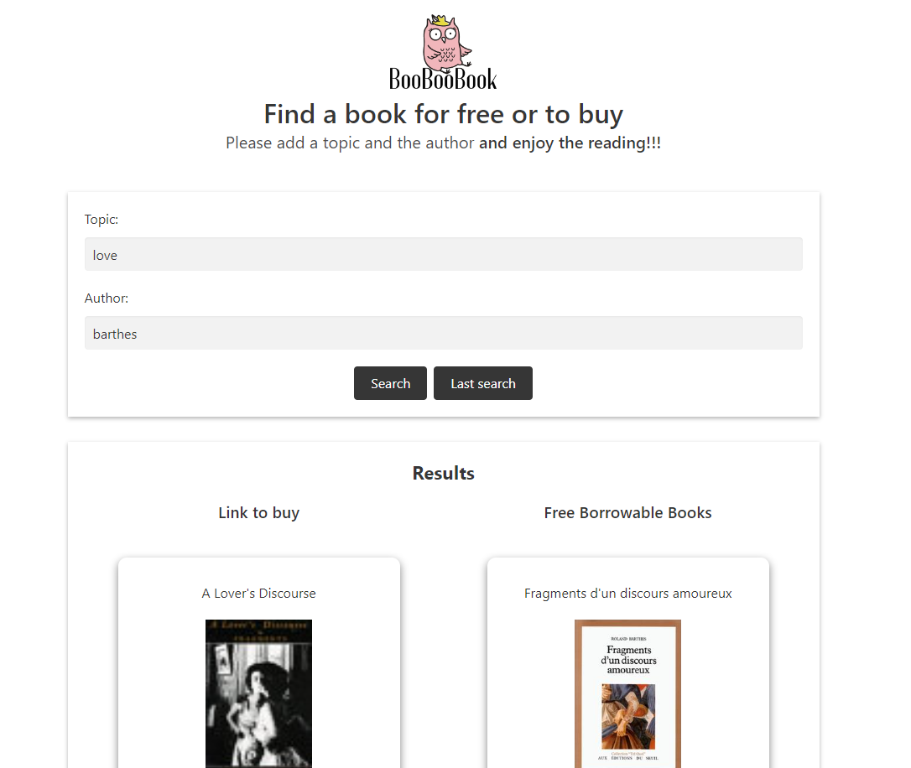

# BooBooBook

## Description

BooBooBook is a web application that compares two online libraries for books that share the same author and similar topics, It uses the GoogleBooks API as well as the OpenLibrary API, Google Books has the link to where you can buy the books, and OpenLibrary has borrowable free books that you can read for free.  

## Installation

N/A

## Usage

In order to search for a book you have to write the author and topic, then you will click on the submit button, two columns will appear on the webpage, on the left side you will have the books that you can buy, on the right side you have the books that are borrowable and free from Open Library, if for any reason you close the webpage and forget what books you were looking for, you can click on the Last Search button and will make the last search that you did.

You can visit the website here: 

https://jonathanc0bosr.github.io/BooBooBooks/

## Credits

N/A

## License

N/A

